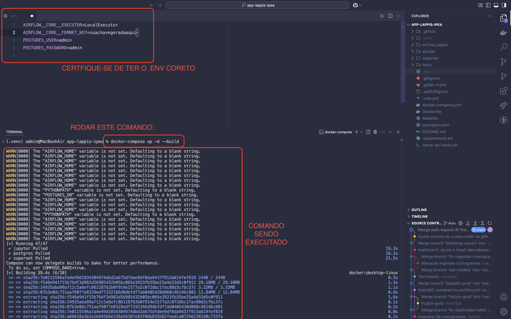
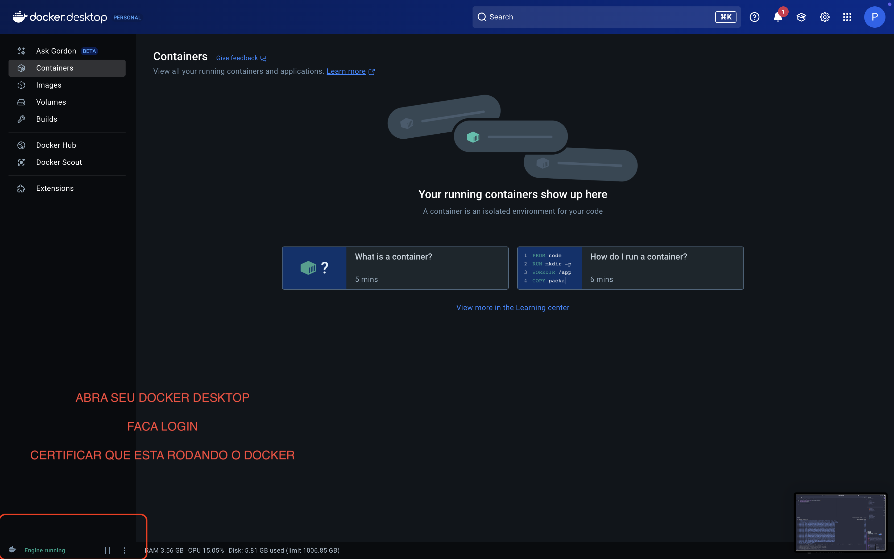
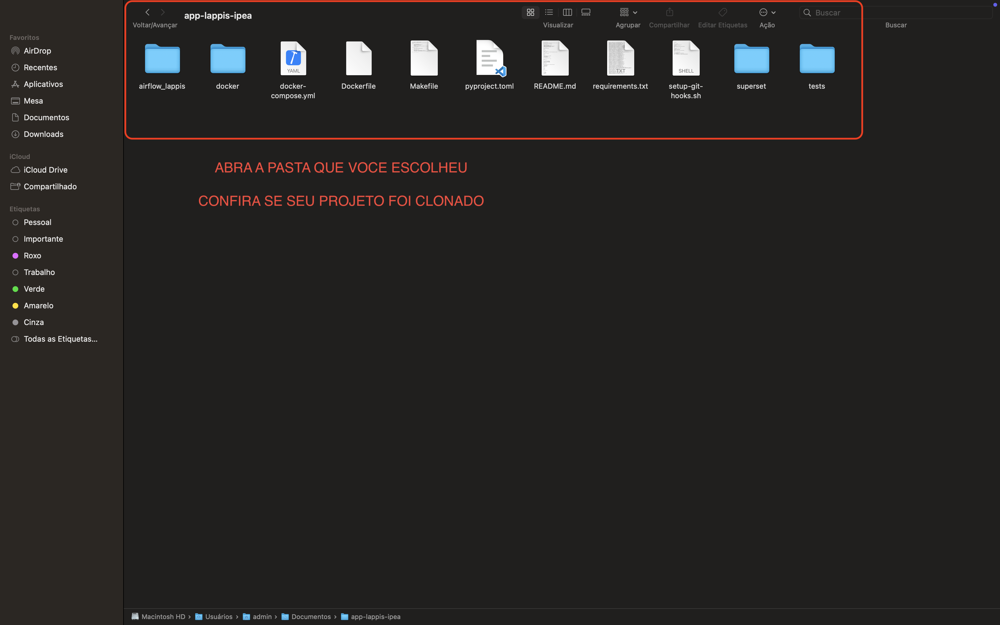
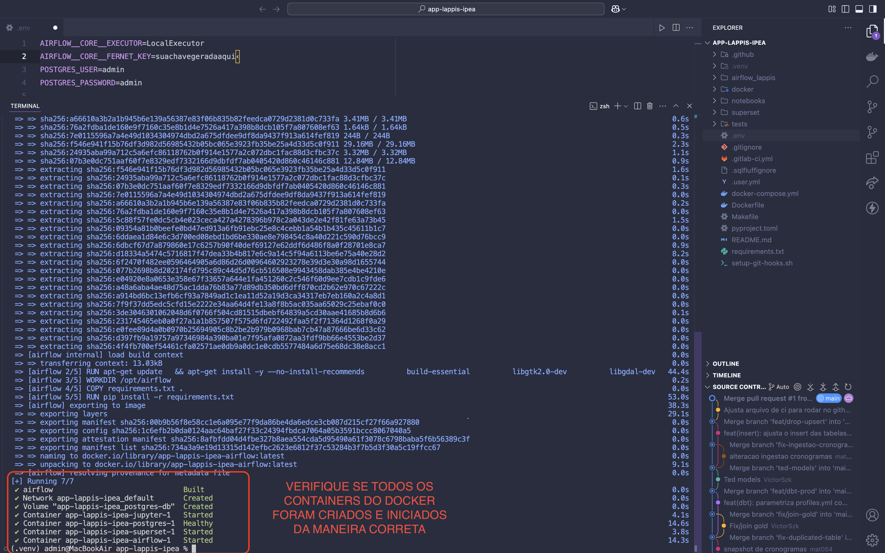
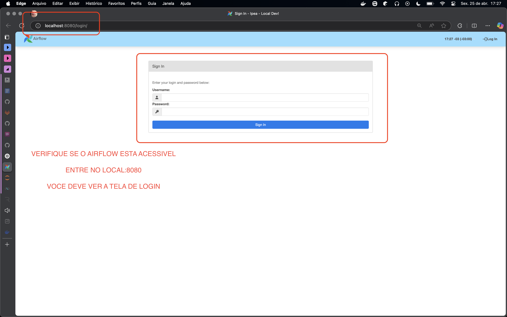
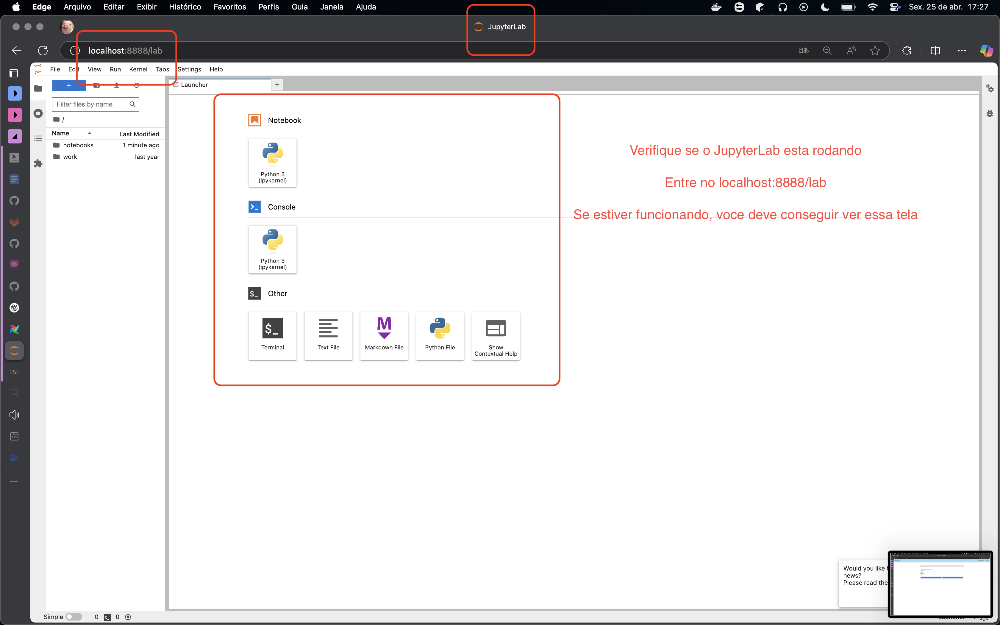
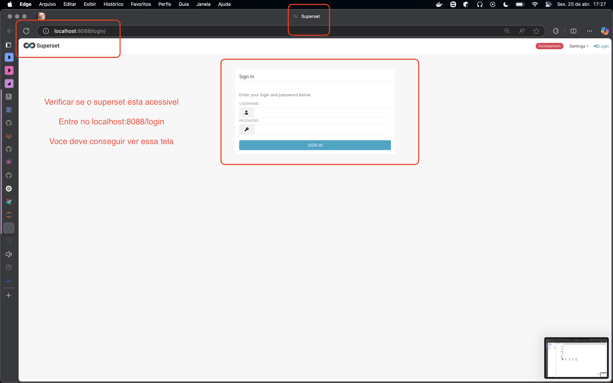
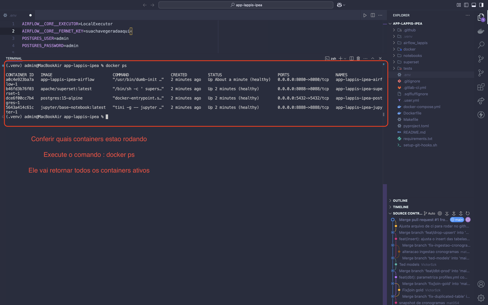

# Projeto de Pipeline de Dados  
[](CONTRIBUTING.md)

Este projeto implementa uma stack moderna de dados usando Airflow, dbt, Jupyter e Superset para orquestração, transformação, análise e visualização de dados.

---

## 🚀 Componentes da Stack

- **Apache Airflow**: Orquestração de workflows  
- **dbt**: Transformação de dados  
- **Jupyter**: Análise de dados interativa  
- **Apache Superset**: Visualização e exploração de dados  
- **Docker**: Containerização e desenvolvimento local  
- **Make**: Automação de build e configuração  

---

## 📋 Pré-requisitos

- Docker e Docker Compose  
- Make  
- Python 3.x  
- Git  

---

## 🔧 Configuração

Clone o repositório:

```bash
git clone git@gitlab.com:lappis-unb/gest-odadosipea/app-lappis-ipea.git
cd app-lappis-ipea
```

Execute o setup usando Make:

```bash
make setup
```

Isso vai:

- Criar ambientes virtuais necessários  
- Instalar as dependências  
- Configurar hooks de pre-commit  
- Preparar o ambiente de desenvolvimento  

---

## 🏃‍♂️ Rodando Localmente

> **Nota:** O passo a passo abaixo é para **macOS**. Para Linux e Windows, veja as seções específicas.

### 1. Instalar o Homebrew (se ainda não tiver)

```bash
/bin/bash -c "$(curl -fsSL https://raw.githubusercontent.com/Homebrew/install/HEAD/install.sh)"
```

### 2. Instalar Python e pip via Homebrew (se precisar)

```bash
brew install python
```

Verifique se `python3` e `pip3` estão instalados:

```bash
python3 --version
pip3 --version
```

### 3. Criar e ativar o ambiente virtual

```bash
python3 -m venv .venv
source .venv/bin/activate
```

### 4. Instalar a dependência `cryptography`

```bash
pip install cryptography
```

### 5. Gerar uma chave Fernet

```bash
python3 -c "from cryptography.fernet import Fernet; print(Fernet.generate_key().decode())"
```

Copie a chave gerada para o próximo passo.

### 6. Criar o arquivo `.env`

No diretório do projeto, crie o `.env` com:

```env
AIRFLOW__CORE__EXECUTOR=LocalExecutor
AIRFLOW__CORE__FERNET_KEY=<sua_fernet_key>
POSTGRES_USER=admin
POSTGRES_PASSWORD=admin
```

### 7. Iniciar o Docker Desktop

Deixe o Docker aberto e rodando.

### 8. Subir os containers com Docker Compose

```bash
docker compose up -d --build
```

### 9. Acessar os serviços

- **Airflow**: http://localhost:8080 (login: `airflow`, senha: `airflow`)  
- **Jupyter**: http://localhost:8888 (usar o token do terminal)  
- **Superset**: http://localhost:8088 (login: `admin`, senha: `admin`)  

---

## 🐧 Rodando no **Linux**

> **Nota:** Essa seção ainda está em construção, mas você pode seguir os passos abaixo.

### 1. Instalar dependências

```bash
sudo apt update
sudo apt install -y python3 python3-venv python3-pip git docker.io docker-compose
```

### 2. (Opcional) Adicionar seu usuário ao grupo docker

```bash
sudo usermod -aG docker $USER
newgrp docker
```

### 3. Clonar o repositório

```bash
git clone git@gitlab.com:lappis-unb/gest-odadosipea/app-lappis-ipea.git
cd app-lappis-ipea
```

### 4. Criar e ativar o ambiente virtual

```bash
python3 -m venv .venv
source .venv/bin/activate
```

### 5. Instalar a dependência `cryptography`

```bash
pip install cryptography
```

### 6. Gerar a chave Fernet

```bash
python3 -c "from cryptography.fernet import Fernet; print(Fernet.generate_key().decode())"
```

### 7. Criar o arquivo `.env`

```env
AIRFLOW__CORE__EXECUTOR=LocalExecutor
AIRFLOW__CORE__FERNET_KEY=<sua_fernet_key>
POSTGRES_USER=admin
POSTGRES_PASSWORD=admin
```

### 8. Subir os containers

```bash
docker compose up -d --build
```

### 9. Acessar os serviços

- **Airflow**: http://localhost:8080  
- **Jupyter**: http://localhost:8888  
- **Superset**: http://localhost:8088  

---

## 🪟 Rodando no **Windows**

> **Nota:** Essa seção também está em construção.

### 1. Instalar o [WSL2](https://docs.microsoft.com/en-us/windows/wsl/install) e o Ubuntu pela Microsoft Store

### 2. Instalar o [Docker Desktop para Windows](https://www.docker.com/products/docker-desktop)

- Ativar a integração com o WSL2 nas configurações do Docker Desktop.

### 3. Instalar Python e Git no Ubuntu (WSL2)

```bash
sudo apt update
sudo apt install -y python3 python3-venv python3-pip git
```

### 4. Clonar o repositório

```bash
git clone git@gitlab.com:lappis-unb/gest-odadosipea/app-lappis-ipea.git
cd app-lappis-ipea
```

### 5. Criar e ativar o ambiente virtual

```bash
python3 -m venv .venv
source .venv/bin/activate
```

### 6. Instalar a dependência `cryptography`

```bash
pip install cryptography
```

### 7. Gerar a chave Fernet

```bash
python3 -c "from cryptography.fernet import Fernet; print(Fernet.generate_key().decode())"
```

### 8. Criar o arquivo `.env`

```env
AIRFLOW__CORE__EXECUTOR=LocalExecutor
AIRFLOW__CORE__FERNET_KEY=<sua_fernet_key>
POSTGRES_USER=admin
POSTGRES_PASSWORD=admin
```

### 9. Subir os containers

```bash
docker compose up -d --build
```

### 10. Acessar os serviços

- **Airflow**: http://localhost:8080  
- **Jupyter**: http://localhost:8888  
- **Superset**: http://localhost:8088  

---

## 📸 Prints de Instalação e Execução

**macOS / Linux / Windows**  

-   
  *Executando o comando de build do Docker.*

  ---

-   
  *Docker Desktop aberto e em execução.*

  ---

-   
  *Pasta do projeto após clonar o repositório.*

  ---

-   
  *Build do Docker concluído com sucesso.*

  ---

-   
  *Interface web do Airflow em execução e acessível.*

  ---

-   
  *Interface do Jupyter Notebook em execução e acessível.*

  ---

-   
  *Interface do Superset em execução e acessível.*

  ---

-   
  *Todos os containers do Docker em execução e ativos.*

  ---

## 💻 Desenvolvimento

### Qualidade de Código

Esse projeto usa várias ferramentas pra garantir qualidade:

- Hooks de pre-commit  
- Configurações de lint  
- Testes automatizados  

Rodar o lint:

```bash
make lint
```

Rodar os testes:

```bash
make test
```

---

### Estrutura do Projeto

```
.
├── airflow/
│   ├── dags/
│   └── plugins/
├── dbt/
│   └── models/
├── jupyter/
│   └── notebooks/
├── superset/
│   └── dashboards/
├── docker-compose.yml
├── Makefile
└── README.md
```

---

### Comandos do Makefile

- `make setup`: Configura o projeto  
- `make lint`: Rodar checagem de lint  
- `make tests`: Rodar testes  
- `make clean`: Limpar arquivos gerados  
- `make build`: Buildar imagens Docker  

---

## 🔐 Fluxo de Git

Esse projeto exige commits assinados. Para configurar:

1. Gerar uma chave GPG:

```bash
gpg --full-generate-key
```

2. Configurar o Git:

```bash
git config --global user.signingkey SEU_ID_DE_CHAVE
git config --global commit.gpgsign true
```

3. Adicionar sua chave GPG na conta do GitLab.

---

## 📚 Documentação

- [Documentação do Airflow](

https://airflow.apache.org/)
- [Documentação do dbt](https://docs.getdbt.com/)
- [Documentação do Superset](https://superset.apache.org/)
